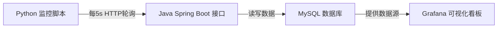

# 云原生网络监控自愈平台 

## 项目简介
本项目是一个面向网络运维场景的轻量级监控系统。通过 Spring Boot 模拟网络设备（OSPF/BGP）状态，
使用 Python 脚本实现定时轮询监控，并将数据持久化至 MySQL，最终通过 Grafana 实现可视化展示。
全部服务通过 Docker Compose 容器化编排，实现一键部署。
将项目迁移至 Kubernetes，编写 Deployment 与 Service YAML 实现容器化服务的集群部署。

##成果总结
实现了一个包含4个微服务、5个技术组件的完整监控闭环，支持一键部署与实时可视化

## 系统架构

## 技术栈
- 后端：Java 17, Spring Boot 3.2.5, Spring Data JPA
- 数据库：MySQL 8.0
- 监控：Python 3, requests
- 可视化：Grafana
- 容器化：Docker, Docker Compose,Kubernetes

## 快速开始
### 1. 克隆仓库
git clone https://github.com/HDAX416/network-monitor.git

### 2. 一键启动所有服务
docker-compose up -d

### 3. 验证服务
curl http://localhost:8080/status

### 4. 运行监控脚本
python monitor.py

### 5. 访问 Grafana 看板
打开浏览器访问 http://localhost:3000
默认账号：admin / admin

### 6. Kubernetes 部署
kubectl apply -f mysql-k8s.yaml
kubectl apply -f java-k8s.yaml
kubectl port-forward svc/java-service 8080:8080

## 项目亮点
- 模拟 OSPF/BGP 路由协议状态变化，贴近真实网络运维场景
- 全链路容器化部署，一条命令即可拉起所有服务
- Grafana 实时时间序列图表，直观展示网络健康趋势
- 预留自愈接口，可扩展为自动化故障恢复系统
- 实现容器化服务的集群部署

## CI/CD
本项目已接入 GitHub Actions 自动化流水线：
- 推送代码到 main 分支自动触发构建
- 自动构建 Docker 镜像并推送至阿里云容器镜像服务
- 镜像地址：registry.cn-hangzhou.aliyuncs.com/hong256/repositories1:latest

## 后续计划
- [ ] 集成真实网络设备（通过 SNMP 或 Netmiko）
- [ ] 添加邮件/钉钉告警通知
